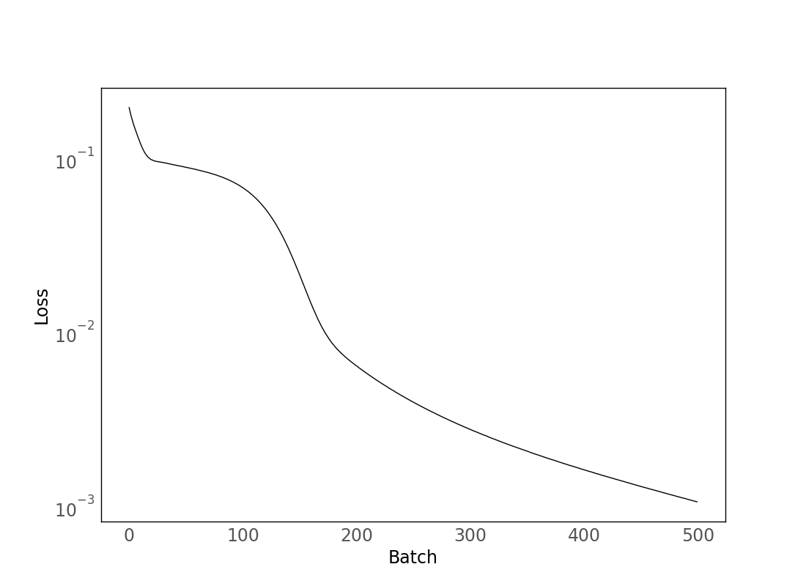

Generate C-code for wrapping simple Keras models, by the simple expedient of putting the weights directly into the c files.

Of course, there are much better ways to do this with external packages. But this is extremely easy to use for easy cases, and we should strive to "make the easy cases easy".

With a trained model:
```python
model = tf.keras.Sequential([
    tf.keras.layers.Dense(10, activation='tanh'),
    tf.keras.layers.Dense(10, activation='tanh'),
    tf.keras.layers.Dense(1, activation='linear'),
])
model.compile(optimizer=tf.keras.optimizers.Adam(learning_rate=1e-3), loss='mse')

x = np.random.uniform(size=(1000, 1), low=-1, high=1)
y = x ** 2
model.fit(x, y, epochs=500, batch_size=500)
```


we create a C wrapper (for a fixed `usage_batch_size`) like this
```python
from keras_cmodel import CModel

usage_batch_size = 5
cmodel = CModel(model, usage_batch_size)
cmodel.save(name='MLP')  # Writes MLP.c and MLP.h
```

Note that the size of MLP.c will grow with network size, but MLP.h will stay small.

Then, you can have user code like e.g. `MLP_test.c`
```C
#include "MLP.h"

int main() {
    setup();
    double inputs[] = {-1, -.5, 0, .5, 1};
    double outputs[5];
    MLP(inputs, outputs);
    print_array("outputs", outputs, 5, 1);
}
```
which you compile with `gcc MLP_test.c MLP.c -lm -o MLP_test`.

(Doing this for a larger `np.linspace` batch of inputs and plotting:)


See `demo.py` for a fuller version of the demo described above.

